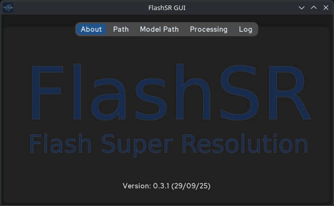
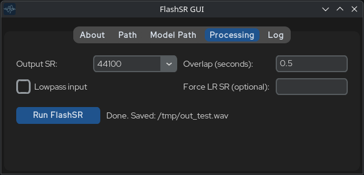
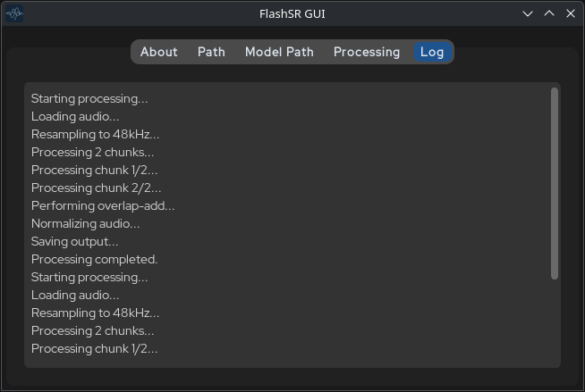

# FlashSR: Simple GUI on Tkinter
[](https://arxiv.org/abs/2501.10807) [](https://jakeoneijk.github.io/flashsr-demo/)



This is CustomTkinter GUI for FlashSR.

If you find this repository helpful, please consider citing it.
```bibtex
@article{im2025flashsr,
  title={FlashSR: One-step Versatile Audio Super-resolution via Diffusion Distillation},
  author={Im, Jaekwon and Nam, Juhan},
  journal={arXiv preprint arXiv:2501.10807},
  year={2025}
}
```
### Features:
One or batch Processing audio, selection of 48k/44k sample rate, settings for Overlap selection, Lowpass input, Force Sample rate for audio.



Simple Log for debuging and processing.



## Set up
### Clone the repository.
```
git clone github.com/Lefox-DeMod/FlashSR_Inference_GUI
```
```
cd FlashSR_Inference
```

### Manual install
```
python -m venv venv
```

### Activate virtual enviroment
```
source venv/bin/activate
```
if using Windows CMD:
```
source venv\Scripts\activate.bat
```
### CPU install pytorch.
If need use CPU installation only:
```
pip install -r requirements_cpu.txt
```

### GPU (CUDA) install
If GPU avalaible:
```
pip install -r requirements.txt
```

### Setup this repository and install all requirements
Unix-like
```
TORCH_JAEKWON_PATH='./TorchJaekwon' pip install -e ./
```
Windows:
```
TORCH_JAEKWON_PATH='.TorchJaekwon' pip install -e .
```

### Download pretrained weights. 

[](https://huggingface.co/datasets/jakeoneijk/FlashSR_weights/tree/main)

Put downloaded model in `./ModelWeights` folder.
## Use

Run GUI:
```
python simple_gui.py
```
It will run on CUDA, or CPU if using manual install.

### Please check Example.py

After installation, you can import the module from anywhere
```python
from FlashSR.FlashSR import FlashSR

student_ldm_ckpt_path:str = './ModelWeights/student_ldm.pth'
sr_vocoder_ckpt_path:str = './ModelWeights/sr_vocoder.pth'
vae_ckpt_path:str = './ModelWeights/vae.pth'
flashsr = FlashSR( student_ldm_ckpt_path, sr_vocoder_ckpt_path, vae_ckpt_path)
```

Read the low-resolution audio
```python
audio_path:str = './Assets/ExampleInput/music.wav'

# resample audio to 48kHz
# audio.shape = [channel_size, time] ex) [2, 245760]
audio, sr = UtilAudio.read(audio_path, sample_rate = 48000)

# currently, the model only supports 245760 samples (5.12 seconds of audio)
audio = UtilData.fix_length(audio, 245760)
audio = audio.to(device)
```

Restore high-frequency components by FlashSR
```python
# lowpass_input: if True, apply lowpass filter to input audio before super resolution. This can help reduce discrepancy between training data and inference data.
pred_hr_audio = flashsr(audio, lowpass_input = False)
UtilAudio.write('./output.wav', pred_hr_audio, 48000)
```


## References
- [AudioSR](https://github.com/haoheliu/versatile_audio_super_resolution)
- [NVSR](https://github.com/haoheliu/ssr_eval)
- [BigVGAN](https://github.com/NVIDIA/BigVGAN)
- [Diffusers](https://github.com/huggingface/diffusers)
